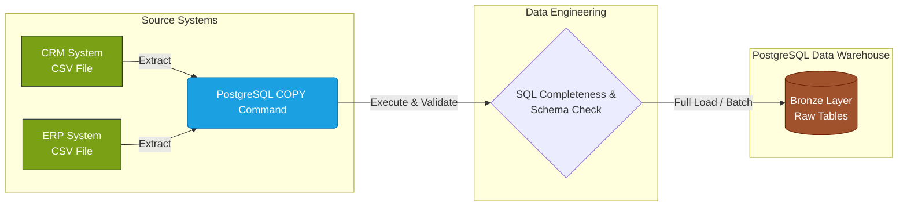
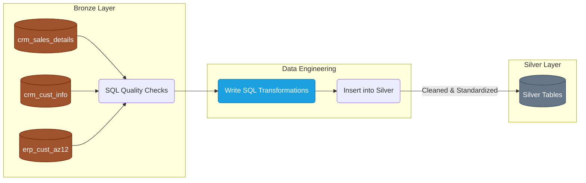
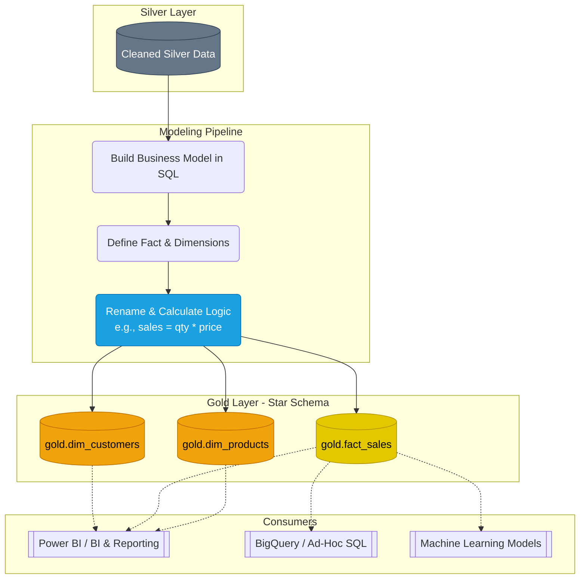

# Enterprise Sales Data Warehouse Pipeline

## Overview
This repository contains the data engineering pipeline for our Enterprise Sales Data Warehouse. The architecture follows a robust Medallion pattern (Bronze, Silver, Gold), extracting raw data from internal CRM and ERP systems and transforming it into a business-ready Star Schema using **PostgreSQL**. 

The final Gold layer is optimized for seamless consumption by Microsoft Power BI for reporting, Google BigQuery for ad-hoc SQL analysis, and downstream Machine Learning models.

## Prerequisites
*   **PostgreSQL:** The core relational database engine for all data warehouse layers.
*   **SQL Client (pgAdmin):** For executing database commands and scripts.
*   **Git:** For version control and documentation of the data model.
*   Access to the source CRM and ERP file directories (CSV drop locations accessible by the Postgres server).
*   Access to the target Data Warehouse environment.

---

## Step-by-Step Execution Process

### Step 1: Data Ingestion (Source to Bronze)
The first phase involves extracting raw data directly from the source systems without applying any transformations.
1.  **Extract:** Source systems (CRM and ERP) export transactional and master data as CSV files into designated secure folders.
2.  **Load:** Execute PostgreSQL `COPY` commands (or `\copy` via psql) to run a full batch load (truncate and insert) directly into the **Bronze Layer** raw tables.
3.  **Validate:** The pipeline performs automated SQL-based schema validation and data completeness checks to ensure the raw load matches the expected source format.

### Step 2: Data Transformation (Bronze to Silver)
The Silver layer acts as the enterprise source of truth, standardizing data across disparate systems using SQL.
1.  **Cleanse:** Filter out malformed records and handle null values using SQL `WHERE` and `COALESCE` clauses.
2.  **Standardize & Normalize:** Align data types, standardize date formats, and resolve schema discrepancies between the CRM and ERP systems.
3.  **Enrich:** Generate derived columns necessary for downstream processing.
4.  **Load:** Insert the cleaned data into the **Silver Layer** tables 

### Step 3: Business Modeling (Silver to Gold)
The Gold layer introduces business logic and structures the data for analytical consumption. 
1.  **Integrate:** Write SQL transformations to join the standardized Silver tables.
2.  **Apply Logic:** Calculate core business metrics (e.g., computing `sales_amount` as `quantity * price`).
3.  **Model:** Restructure the data into a Star Schema consisting of:
    *   `gold.fact_sales` (Transactional metrics)
    *   `gold.dim_customers` (Customer attributes)
    *   `gold.dim_products` (Product hierarchy)
4.  **Deploy:** Instantiate these models as PostgreSQL `VIEW`s within the Data Warehouse schema.

### Step 4: Data Consumption
Once the Gold views are materialized, the data is ready for the business:
*   **BI and Reporting:** Connect Microsoft Power BI directly to the PostgreSQL Gold views to refresh automated dashboards.
*   **Ad-Hoc Querying:** Analysts can query the Star Schema using standard SQL via any PostgreSQL client.
*   **Advanced Analytics:** Data scientists can pull clean, historical feature sets for machine learning models.

---

